# 🩲 Hippopants Mobile App (Unofficial)

Bu proje, [hippopants.com](https://hippopants.com/) için Flutter ile geliştirilen **resmî olmayan** bir mobil uygulamadır. Uygulama henüz tamamlanmamıştır ve şu anda herhangi bir backend bağlantısı bulunmamaktadır.

> ⚠️ Not: Bu uygulama resmi *hippopants* markasıyla bağlantılı değildir. Kişisel bir portföy projesidir.

---

## 🚀 Tamamlanan Özellikler

- Ana sayfa ve ürün listeleme
- Ürün detay sayfası
- Sepet sayfası
- Giriş yapma ve üye olma ekranları
- Ödeme sayfası (UI)
- Adresleri görüntüleme ve yeni adres ekleme
- Siparişleri görüntüleme

---

## 🔧 Kullanılan Teknolojiler

- Flutter & Dart  
- GetX (State Management & Routing)

---

## 📱 Ekran Görüntüleri

Tüm ekran görüntüleri `screenshots/` klasöründe yer almaktadır.

---

### 🔐 Giriş & Kayıt

 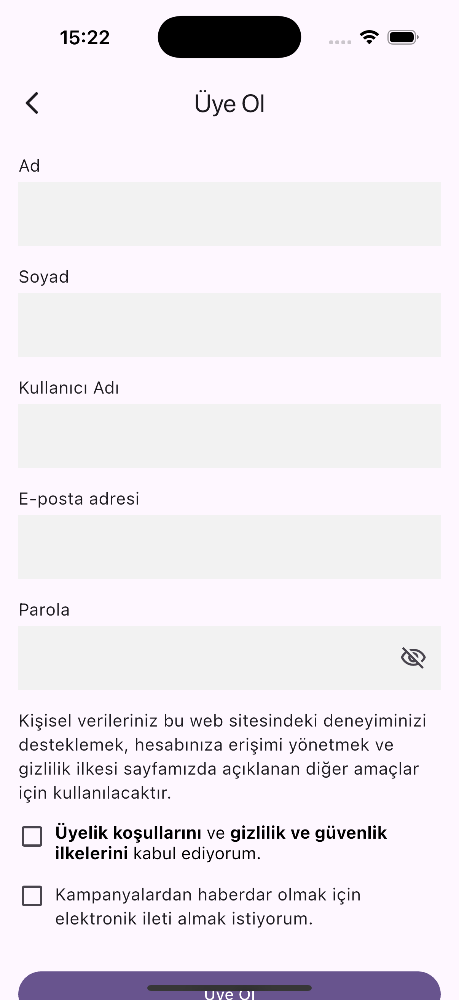

---

### 🏠 Ana Sayfa

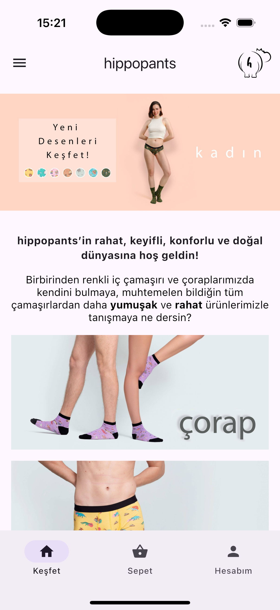 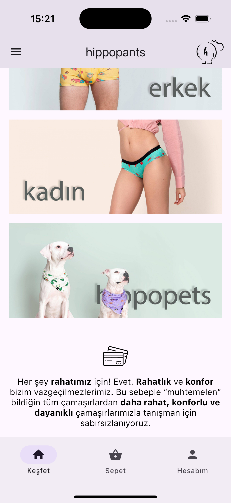  
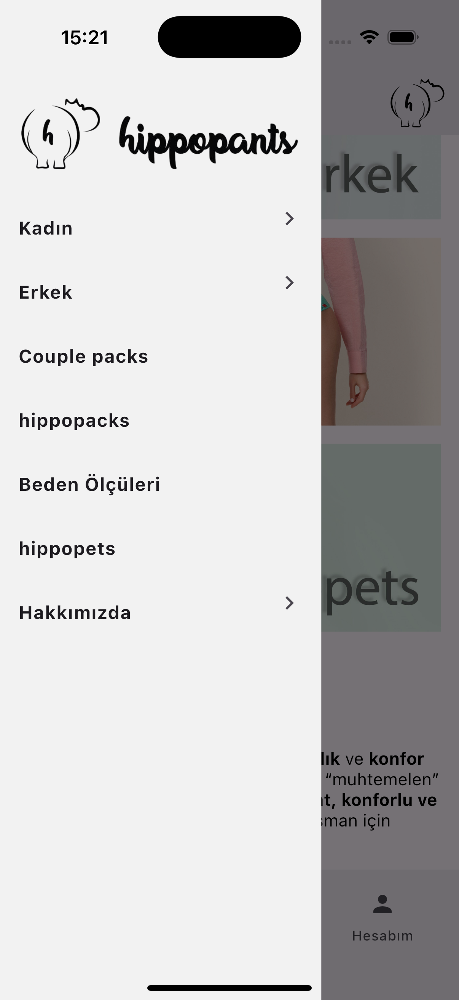

---

### 📄 Ürün Detayları

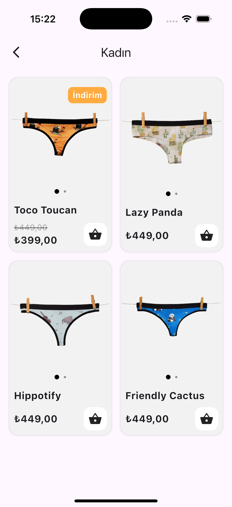   
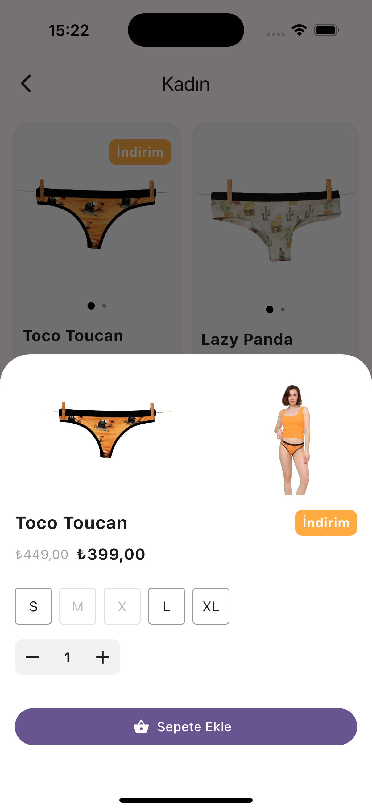 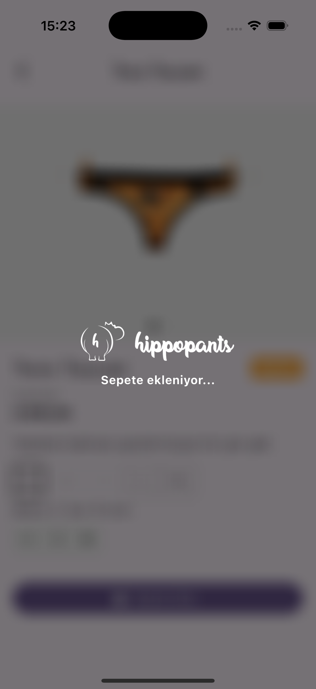

---

### 🏡 Adresler

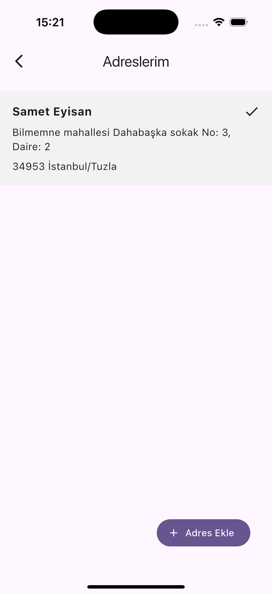 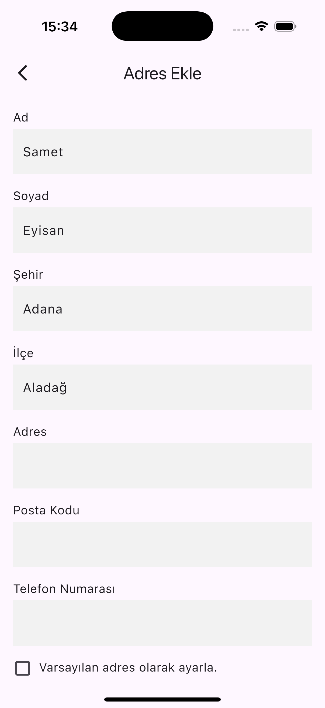

---

### 📦 Siparişler


---

### 🛒 Sepet

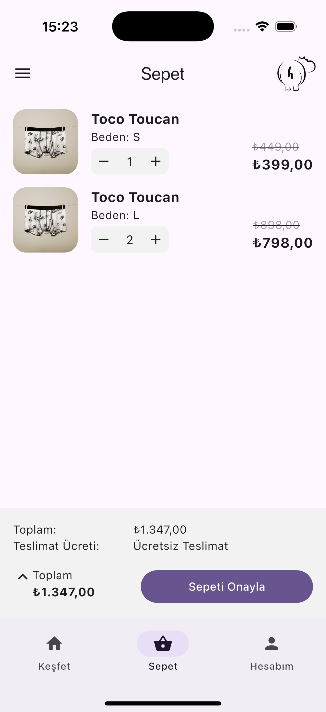

---

### 💳 Ödeme

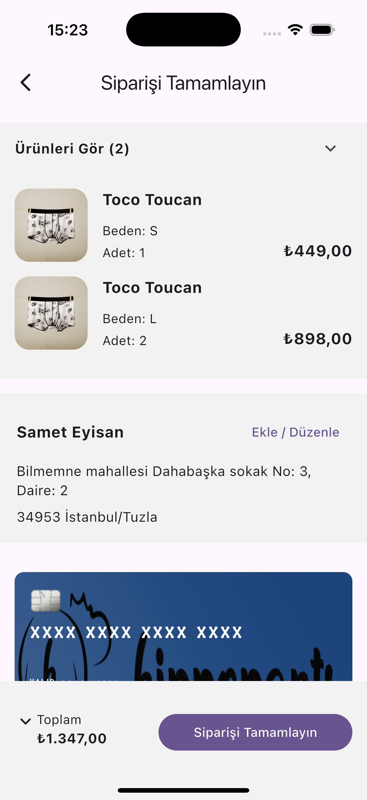 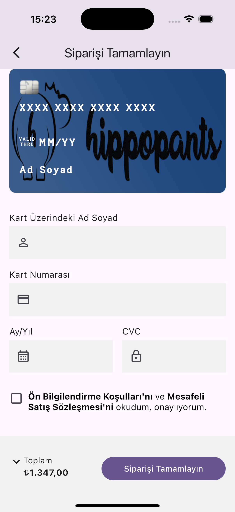

---


## 📂 Kurulum

Projeyi yerelde çalıştırmak için:

```bash
git clone https://github.com/sameteyisan/hippopants.git
cd hippopants-mobile
flutter pub get
flutter run